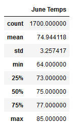
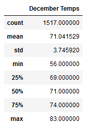
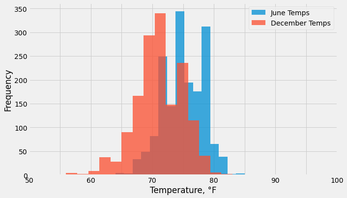
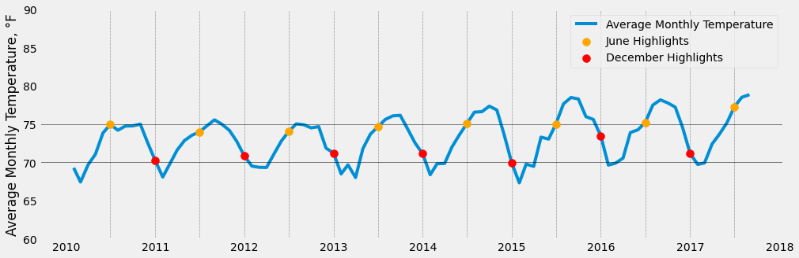

# Module 09 Challenge - Surfing Climate Analysis

## Overview

The purpose of this analysis is to present additional information related
to temperature data for the months of June and December in Oahu, Hawaii.

### Deliverables:
1. Summary Statistics for June
2. Summary Statistics for December
3. This written report

### Resources

- Software:
	- Jupyter notebook server 6.3.0, running Python 3.7.10 64-bit (Dependencies: datetime, matplotlib, numpy, pandas, sqlalchemy)
- Data: Weather Station Data Acquired from NOAA Weather Stations in the US State of Hawaii. Stored in a SQLite Database and provided by potential investor W. Avy:
	`hawaii.sqlite`

Additional information about these resources is outlined below in Table 1.

**Table 1:**
| File Name                   | Brief Description of Contents |
|-----------------------------|-------------------------------|
|`hawaii.sqlite`              |SQLite Database containing two Tables: `measurement` and `station`. The `measurement` Table contains Five (5) fields, `id`, `station`, `date`, `prcp`, and `tobs`. The `stations` Table contains Six (6) fields, `id`, `station`, `name`, `latitude`, `longitude`, and `elevation`.  Contains 19,550 Measurement Observations taken from Nine (9) NOAA Weather Stations in the US State of Hawaii between the dates of January 01, 2010 and August 23, 2017.|

Further detail about the data-containing fields of the Tables in `hawaii.sqlite` is outlined below in Table 2.

**Table 2:**
| Table Name                  | Field Name     | Brief Description of Field and Contents |
|-----------------------------|----------------|-----------------------------------------|
|`measurement`                |`id`            |Unique id number of measurement observation, maximum one per station per day [Not all Stations reporting measurements for all days]. One observation consists of *one* `prcp` Precipitation Measurement and *one* `tobs` Temperature Measurement, associated with the specified `station` on the given `date`. Time of observation on `date` is uncertain.
|                             |`station`       |Unique station id, consisting of 3-letter Capital Alpha Code Followed by 8-digit Numeric Identifier.
|                             |`date`          |Gregorian Calendar date, ISO 8601 Formatted as 'YYYY-MM-DD'
|                             |`prcp`          |Total Observed Precipitation on `date`, US Customary Inches (Reported as Decimal Inches to the Hundredth Place in the form of dd.dd).
|                             |`tobs`          |Observed Temperature on `date`, Degrees Fahrenheit (Reported as Whole Degrees in the form of dd.0).
|`stations`                   |`id`            |Unique id number of station listing.
|                             |`station`       |Unique station id, consisting of 3-letter Capital Alpha Code Followed by 8-digit Numeric Identifier.
|                             |`name`          |Descriptive Name of Station, Capitalized free text.
|                             |`latitude`      |NAD83 Latitude of `station` location, in decimal form dd.xxxx (Positive North, Negative South).
|                             |`longitude`     |NAD83 Longitude of `station` location, in decimal form dd.xxxx (Positive East, Negative West).
|                             |`elevation`     |NAD83 Elevation of `station` location, SI-Meters (Reported as Decimal Meters to the Tenth Place in the form of ddd.d)

## Deliverables

### Deliverable 1

See `SurfsUp_Challenge.ipynb`, ***Deliverable 1***.

### Deliverable 2

See `SurfsUp_Challenge.ipynb`, ***Deliverable 2***.

### Deliverable 3

Describe the key differences in weather between June and December, and provide two recommendations for further analysis.

See ***Results*** and ***Summary*** Below.

## Results

Like many locations on Earth, Hawaii experiences seasonal fluctuation in weather patterns, that are measurable in terms of physical phenomena such as Observed Temperature and Precipitation. This is in accordance with the rotation of the Earth, the procession of the Earth around the Sun, the change in relative axial position of the Earth's Axis to the Sun, the relative distance of the Earth to the Sun in accordance with its elliptical orbit, and other environmental factors.

Depending on where a particular location is situated on Earth, the given seasonal fluctuation can be extreme or mild, according to environmental factors such as distance from the equator, distance to the nearest ocean or large body of water, trade winds, prevailing ocean currents, atmospheric conditions, solar activity, near or distant volcanic activity, and climate change--anthropogenic or otherwise.

For the time being in this analysis, we will confine ourselves to the discussion of Temperature alone, and leave any discussion regarding Precipitation for another day.

Concerning Hawaii specifically, there is an observable regular pattern of seasonal temperature variation. Without delving deeply into the specific scientific reasons why, owing to the conditions alluded to above, the seasonal variations in observed temperature measured in Hawaii throughout the course of a typical year could be described as *mild* according to the judgement of most Human Persons.

During the time period under study, the very highest temperature observed was 87.0 deg F, and the very lowest was 53.0 deg F. These being the extremes, all other temperatures by definition will fall between them.

To simplify the discussion a little further, we can consider the temperature patterns exclusively during the solstice months, that is, June and December, when the variation on climate due to the difference in orientation of the Earth's axis relative to the Sun has its greatest effect. Furthermore, we can consider statistical summaries of the data to more easily grasp the broad trends and patterns under consideration.

Figures 1 and 2 below show a basic statistical summary of June and December temperatures observed during the time under study.

|**Figure 1:**                                            |**Figure 2:**|
|---------------------------------------------------------|-------------|
|||

Another way to visualize these two distributions is via an overlapping Histogram, as shown here in Figure 3.

**Figure 3:**

Since the Histogram in *Figure 3* does not explicitly display a temporal character, a time series of average temperature per month is plotted below in Figure 4. The average temperature of each June and December is highlighted on the plot according to the Legend, and guidelines for reference are shown on the y-axis at 70 deg F and 75 deg F.

**Figure 4:**

To summarize the results more concisely, we should consider these three key differences between June and December:
- **Difference 1**: The minimum temperature observed in December, at 56 deg F, is roughly 10 degrees lower than the minimum temperature observed in June. According to history and professional experience, is 56 deg F too low for most people to enjoy surfing and ice cream? During this time a seasonal closure of shop may be preferable to reduce costs and minimize overhead.
- **Difference 2**: Not only do the minimum temperatures vary, but the average temperatures are consistently different as well. In June, the average temperature is consistently around 75 deg F, while in December it is consistently around 70 deg F. Again, the question must be asked: Does this consistent difference of an average of 5 degrees in temperature have a measurable impact on customer behavior and business returns?
- **Difference 3**: As shown in *Figure 3*, the general patterns for observed temperatures between June and December are broadly similar at first glance, with their Means differing by approximately 5 deg F. However, upon closer inspection, the June observations are skewed slightly where warmer days occur more frequently than colder ones, and the inverse is true in December where colder days occur more frequently than warmer ones. If the shop is to remain open year-round, these seasonal variations may have some bearing on the amount of ice cream that needs to be kept in inventory, with a larger amount kept on hand in June according to demand, and a smaller amount in December. Correlating ice cream consumption to temperature, rather than tracking only a simple measurement of sales by month may allow for a reliable forecast to be generated. Projected future sales figures provided to vendors could allow for more accurate bulk purchases or better negotiation of prices for supplies to the shop, thus increasing profits.

## Summary

Two additional queries that could be performed to gather more weather data for June and December:
1. How does precipitation vary across the seasons, as well as temperature? Is there a rainy season during which no-one would consider going surfing , eating ice cream, or even visiting Hawaii?
2. Is there significant variation in Precipitation and Observed Temperature between Weather Stations? How does elevation and location affect the results?
